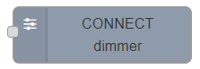
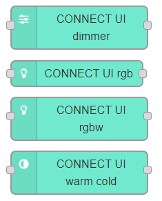

# LED strips

LED strips connection to the LED driver blocks

## 📜 Supported devices

- [W4](/docs/blocks/w4) LED driver block

## 🖇️ How to connect

Soon...

## 💻 How to control

Any device is controlled via `nodes`.

:::tip
For more info visit our Node-RED [`CONNECT nodes page`](https://flows.nodered.org/node/connect-nodes)
:::

For control of the LED stripe you should to use the `dimmer` node:

:::note
One node is used for each [W4](/docs/blocks/w4) output.
:::

## 📲 How to visualise

For visualisation your LED (Single-color, WW, RGB, RGBW) loads you should to use one of the `UI nodes` below (depends on type of your LED load):

Connect `control node` and `UI node` together and check your App :)